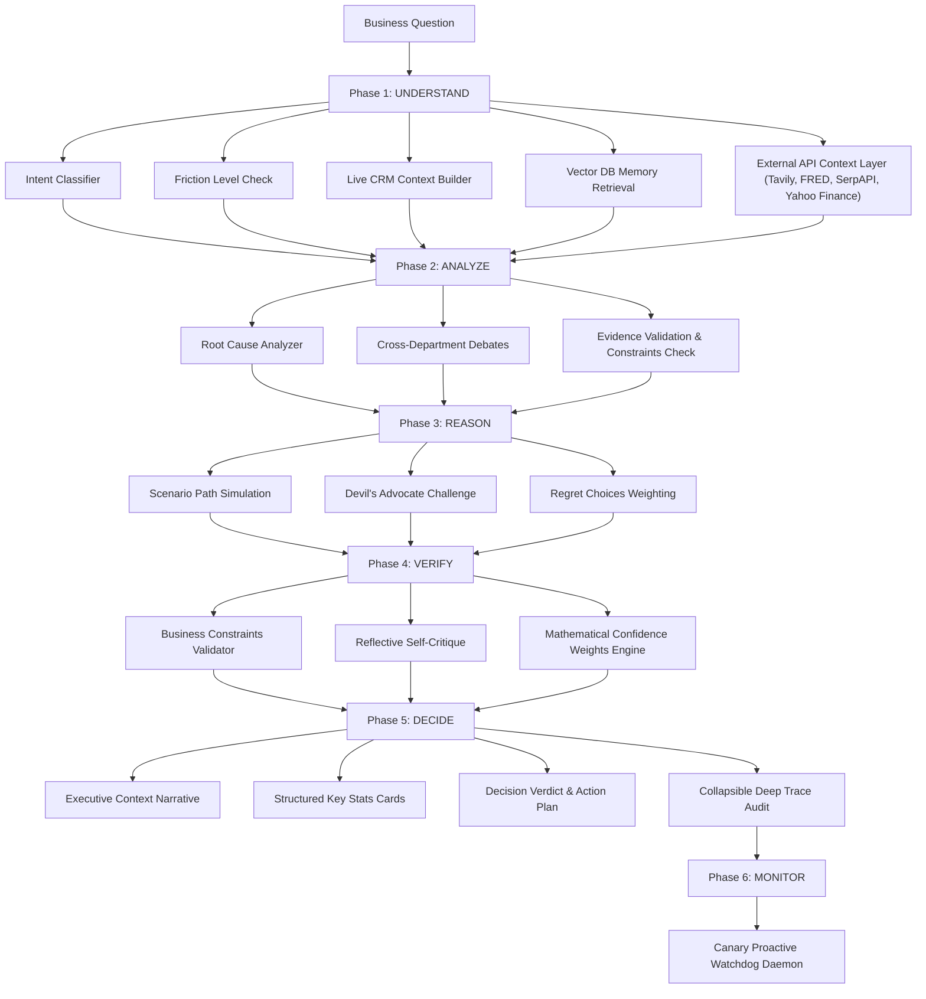

# Friction — Resilient Multi-Agent Cognitive Business Reasoning Engine

Friction is an enterprise-grade, board-level cognitive reasoning advisor designed to help business owners resolve complex operational tensions. Instead of responding with generic answers, it analyzes live CRM data, searches vector memory, simulates scenarios, debates stances across departments, validates evidence against operational constraints, and integrates live market insights.

The engine uses a resilient pipeline leveraging **NVIDIA's Nemotron-3-Ultra-550B** as the primary synthesis engine (for deep cognitive thinking) and automatically falls back to **Groq's Llama 3.3 70B** (`llama-3.3-70b-versatile` or `openai/gpt-oss-120b`) if NVIDIA rate limits, worker capacity limits (503 Service Unavailable), or JSON formatting/truncation errors are encountered.

---

## 🏗️ Cognitive Pipeline Architecture

The reasoning process follows a rigorous 5-Phase, 16-Module reasoning structure:



---

## ✨ Key Features

### 1. Resilient Synthesis Engine
Streams reasoning content from NVIDIA Nemotron-3-Ultra with fallback logic. If the primary model fails or returns truncated/malformed JSON, the pipeline catches it immediately and redirects the synthesis request to Groq's high-capacity models (`llama-3.3-70b-versatile` or `openai/gpt-oss-120b`).

### 2. Live CRM Dashboard & Data Sources Viewer
Provides a comprehensive overview and deep audit of the company's databases. Through the UI sidebar, users can explore **13 connected CRM tables** populated with SQLite data:
*   **Customers**: Average LTV, at-risk accounts, churn metrics.
*   **Deals Pipeline**: Open pipeline value, deal counts, closed-won statistics.
*   **Financials**: 18-month MRR history, net profit margins, revenue trends.
*   **Team**: Departments, role headcount, payroll distribution.
*   **Past Decisions**: Database history of prior decisions, lessons learned, and outcomes.
*   **Products & SKUs**: Product margins, sales velocities.
*   **Inventory**: Stock levels, reorder thresholds (Edge Gateways).
*   **Marketing Campaigns**: Spent budgets, campaign ROI yields.
*   **Support Tickets**: Open ticket spikes, historical CSAT metrics.
*   **Suppliers & Vendors**: Lead times, vendor reliability ratings.
*   **Expenses**: Monthly operational burn and overhead.
*   **Quarterly KPIs**: Annual Recurring Revenue (ARR) growth, NPS metrics.
*   **Contracts**: ARR contract details and renewal dates.

### 3. Document Upload & Retrieval (RAG)
Allows users to upload custom files to extend the vector memory of the engine.
*   **Formats**: Supported extensions include `.pdf`, `.xlsx`/`.xls`, `.csv`, `.txt`, `.md`, and `.json`.
*   **Processing**: Documents are saved to `backend/data/uploads/`, parsed (pages extracted for PDFs, sheets/rows mapped for Excel, comma-separated tokens read for CSVs), and automatically chunked with overlap.
*   **Indexing**: Chunks are embedded and upserted into an in-memory Chroma DB collection.
*   **Management**: Uploaded documents are saved in `uploaded_docs.json` to re-index automatically on server reboot, and can be removed in real time via the UI.

### 4. Canary Proactive Sentinel (Watchdog)
A background thread scheduler daemon that proactively scans company data to detect operational risks.
*   **Scan Scheduler**: Configurable via the UI to run every 1 minute or 1 hour.
*   **Metrics Tracked**: Live stock levels of critical devices (e.g. Edge Gateways) and support ticket spikes.
*   **Z-Score Drift Analysis**: Compares current metrics against a 30-day baseline to compute signal deviations.
*   **Cosine Similarity Matching**: Uses `numpy` vector math to check current metric drift signatures against historical threat patterns in the `canary_failure_library`.
*   **LLM Alert Generation**: If an anomaly (Z-score $\ge 2.0$) or known threat pattern (similarity $\ge 0.85$) is matched, Groq is used to generate a jargon-free **headline problem statement** and a practical, step-by-step **remediation solution**.
*   **Interactive Control Panel**: Features manual scan triggers, scheduler activation toggles, live run countdowns, threat confidence ratings, alert feedback buttons (Correct / False Alarm), and logs auditing.

### 5. External API Context Layer (Tavily, FRED, SerpAPI, Yahoo Finance)
An advisory context layer that pulls live market backdrop data to explain the decision narrative.
*   **Tavily News**: Gathers sector trends, industry updates, and global expansion news.
*   **SerpAPI**: Queries competitor search results, standard benchmarks, and salaries.
*   **FRED (Federal Reserve)**: Fetches macroeconomic indicators like interest rates (FEDFUNDS), inflation index (CPIAUCSL), unemployment rate (UNRATE), and GDP.
*   **Yahoo Finance (`yfinance`)**: Retrieves recent closing prices and 52-week ranges for relevant sector ETFs (e.g. `XLK` for technology, `XLF` for finance, `SPY` for broad markets).
*   **Keyword Routing**: Selects only the APIs relevant to the question intent (e.g. a hiring question skips FRED and stock valuation checks).
*   **Strict Isolation Rule**: This data serves as **advisory framing only**. It is never treated as evidence, never stored in the CRM or vector index, and does not alter the verdict, confidence score, or department stances. If the APIs fail or keys are missing, the pipeline degrades gracefully, returning the same verdict without external context.

---

## 🛠️ Installation & Setup

### Prerequisites
*   Python 3.10+
*   Node.js 18+
*   Git

### 1. Setup Backend
Open a terminal in the `backend/` directory:

```bash
cd backend
# Create virtual environment
python -m venv .venv
# Activate virtual environment (Windows)
.venv\Scripts\activate
# Activate virtual environment (macOS/Linux)
source .venv/bin/activate

# Install dependencies
pip install -r requirements.txt
```

Create a `.env` file in the `backend/` root directory and add your API keys:
```env
# Core LLM keys
GROQ_API_KEY=gsk_your-groq-key-here
NVIDIA_API_KEY=nvapi-your-nvidia-key-here
GROQ_MODEL=openai/gpt-oss-120b

# Advisory external API keys (optional — empty values default to graceful bypass)
TAVILY_API_KEY=tvly-your-tavily-key-here
SERPAPI_API_KEY=your-serpapi-key-here
FRED_API_KEY=your-fred-key-here
```

Seed the databases (generates SQLite `crm.db` and Vector DB `crm_knowledge.json`):
```bash
python data/seed_db.py
```

Start the backend API server:
```bash
python main.py
```
*The server will initialize sentence transformers, load the Chroma index, start the Canary background thread, and begin listening on [http://localhost:8000](http://localhost:8000).*

### 2. Setup Frontend
Open a terminal in the `frontend/` directory:

```bash
cd frontend
# Install packages
npm install
```

Create a `.env` file in the `frontend/` directory specifying the backend URL:
```env
VITE_API_URL=http://localhost:8000
```

Start the development server:
```bash
npm.cmd run dev
```
*The Vite development server will load the UI dashboard on [http://localhost:5173](http://localhost:5173).*

---

## 🚀 Usage

1.  **Reasoning**: Type a strategic question into the dashboard (e.g. *"Should we pursue a tech sector merger given current interest rates?"*) and trigger the pipeline. Review the verdict banner, stats cards, and collapsible traces.
2.  **Canary Watchdog**: Open the **Canary Sentinel** tab. Toggle the scheduler ON to run background scans every minute. View active alerts, click feedback logs, or trigger scans manually.
3.  **Data Explorer**: Open the **Live CRM** tab to query, sort, and inspect rows across all 13 SQLite tables.
4.  **Document Upload**: Drag-and-drop or click to upload a PDF, Excel, CSV, or text file inside the dashboard. Once uploaded, the content is automatically chunked and included in the vector memory retrieval steps for all subsequent reasoning queries.
